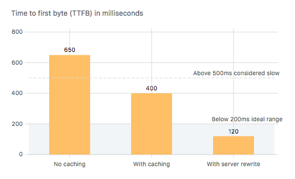
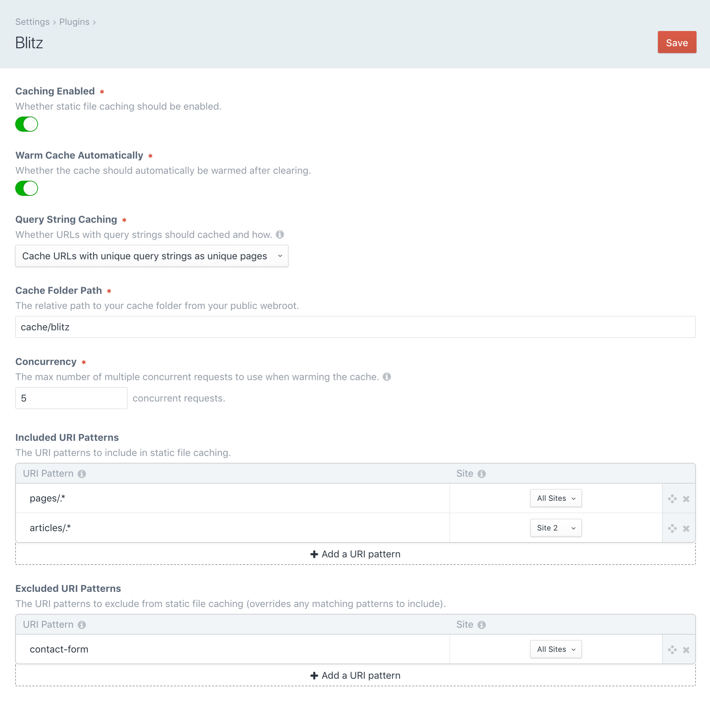
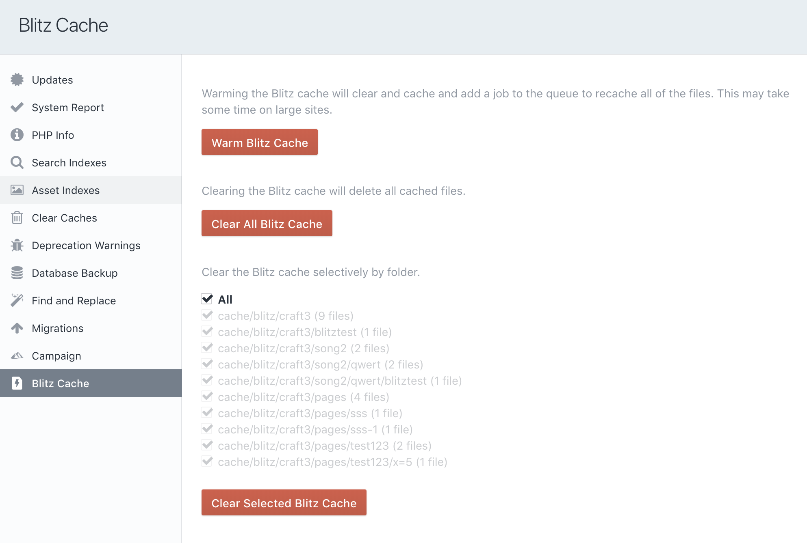
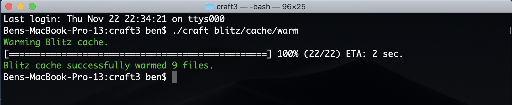

 
# Blitz Plugin for Craft CMS 3

The Blitz plugin provides intelligent static file caching for creating lightning-fast sites with [Craft CMS](https://craftcms.com/).

It can highly improve a site’s performance by reducing the time to first byte (TTFB). This reduces the load time of the site as well as the load on the server. Google recommends a server response time of [200ms or less](https://developers.google.com/speed/docs/insights/Server). 

Although the performance gains depend on the individual site and server setup, the following results are not uncommon (on a 5 Mbps cable connection with 28ms of latency):

- 650ms (without caching enabled) 
- 400ms (with caching enabled, without server rewrite) 
- 120ms (with caching enabled and server rewrite)

  

## License

This plugin requires a commercial license which can be purchased through the Craft Plugin Store.  
The license fee is $59 plus $29 per subsequent year for updates (optional).

## Requirements

Craft CMS 3.0.0 or later.

## Installation

Blitz is available in the Craft Plugin Store and can also be installed manually using composer.

    composer require putyourlightson/craft-blitz

## Quick Setup

After installing the plugin, go to the plugin settings.

1. Turn “Enable Caching” on.
2. Add a row to “Included URI Patterns” such as `__home__` for the homepage or `.*` for the entire site.
3. Save the settings and visit the homepage (it will be cached in the first visit).

## Usage

In the plugin settings, enable caching and add at least one included URI pattern. When a URL on the site is visited that matches an included URI pattern, Blitz will serve a static cached HTML file if it exists, otherwise it will cache the template output to a HTML file. Excluded URI patterns will override any matching included URI patterns. 

Using a [server rewrite](#server-rewrite) (see below) will avoid unnecessary PHP processing and will increase performance even further.

Blitz is compatible with live preview. It will detect when it is being used and will not cache its output or display cached file content (provided the server rewrite, if used, checks for GET requests only).

Craft’s template caching `` tag doesn’t play well with the cache breaking feature in Blitz. Template caching also becomes redundant with static file caching, so it is best to either remove all template caching from URLs that Blitz will cache or to disable template caching completely in the `config/general.php` file:

    'enableTemplateCaching' => false,

## URI Patterns

URI patterns use PCRE regular expressions. Below are some common use cases. You can reference the full syntax [here](http://php.net/manual/en/reference.pcre.pattern.syntax.php).

- A blank field matches the homepage.
- `.*` matches any character 0 or more times (use this to include everything).
- `.+` matches any character 1 or more times.
- `.` matches any character.
- `\d` matches any digit.
- `\d{4}` matches any four digits.
- `\w` matches any word character.
- `\w+` matches any word character 1 or more times.
- `entries` matches anything containing "entries".
- `^entries` matches anything beginning with "entries".
- `^entries/entry$` matches an exact URI.
- `^entries/\w+$` matches anything beginning with "entries/" followed by at least 1 word character.

## Server Rewrite

For improved performance, adding a server rewrite will avoid the request from ever being processed by Craft once it has been cached. 

### Apache

In Apache this is achieved with `mod_rewrite` by adding a rewrite rule to the root .htaccess file, just before the rewrites provided by Craft. Change `cache/blitz` to whatever the cache folder path is set to in the plugin settings.

If the "Query String Caching" setting is set to `Do not cache URLs with query strings` or `Cache URLs with query strings as unique pages` then use the following code.

    # Blitz cache rewrite 
    RewriteCond %{DOCUMENT_ROOT}/cache/blitz/%{HTTP_HOST}/%{REQUEST_URI}/%{QUERY_STRING}/index.html -s
    RewriteCond %{REQUEST_METHOD} GET
    RewriteRule .* /cache/blitz/%{HTTP_HOST}/%{REQUEST_URI}/%{QUERY_STRING}/index.html [L]
    
    # Send would-be 404 requests to Craft

If the "Query String Caching" setting is set to `Cache URLs with query strings as the same page` then use the following code.

    # Blitz cache rewrite 
    RewriteCond %{DOCUMENT_ROOT}/cache/blitz/%{HTTP_HOST}/%{REQUEST_URI}/index.html -s
    RewriteCond %{REQUEST_METHOD} GET
    RewriteRule .* /cache/blitz/%{HTTP_HOST}/%{REQUEST_URI}/index.html [L]
    
    # Send would-be 404 requests to Craft

### Nginx

In Nginx this is achieved by adding a location handler to the configuration file. Change `cache/blitz` to whatever the cache folder path is set to in the plugin settings.

If the "Query String Caching" setting is set to `Do not cache URLs with query strings` or `Cache URLs with query strings as unique pages` then use the following code.

    # Blitz cache rewrite
    location / {
      try_files /cache/blitz/$http_host/$uri/$args/index.html;
    }
    
    # Send would-be 404 requests to Craft

If the "Query String Caching" setting is set to `Cache URLs with query strings as the same page` then use the following code.

    # Blitz cache rewrite
    location / {
      try_files /cache/blitz/$http_host/$uri/index.html;
    }
    
    # Send would-be 404 requests to Craft

## Query Strings

URLs with query strings will be cached according to the selected option in the "Query String Caching" setting  as follows:

- `Do not cache URLs with query strings`: URLs with query strings (anything following a `?` in a URL) will not be cached. Use when query parameters dynamically affect a page's output and should therefore never be cached.
- `Cache URLs with query strings as unique pages`: URLs with query strings will be cached as unique pages, so `domain.com/`, `domain.com/?=1` and `domain.com/?p=2` will be cached separately. Use when query parameters affect a page’s output in a deterministic way and can therefore be cached as unique pages.
- `Cache URLs with query strings as the same page`: URLs with query strings will be cached as the same page, so `domain.com/`, `domain.com/?&utm_source=twitter` and `domain.com/?&utm_source=facebook` will all be cached with the output. Use when query parameters do not affect a page’s output and can therefore be cached as the same page.

## Dynamic Content

When a URL is cached, the static cached file will be served up on all subsequent requests. Therefore you should ensure that only pages that do not contain any content that needs to dynamically changed per individual request are cached. The easiest way to do this is to add excluded URI patterns for such pages. 

Blitz offers a workaround for injecting dynamic content into a cached page using a Javascript XHR (AJAX) request. The following template tags are available for doing so.

#### `{{ craft.blitz.getUri('/template/name') }}`

Returns a script that injects the contents of the URI provided in place of the twig tag. 
 
#### `{{ craft.blitz.csrfInput() }}`

Returns a script that injects a CSRF input field in place of the twig tag.

Below is an example of how you might use the tags to create a page containing dynamic content and a form that can be cached by Blitz.

    Your cart: {{ craft.blitz.getUri('/ajax/cart-items') }}
    
    <form method="post">
       {{ craft.blitz.csrfInput() }}
       ...
     
     </form>

In the case above it would make sense to add `ajax.*` as an excluded URI pattern in the plugin settings.

## Cache Invalidation

When an element is created, updated or deleted, any cached template files that used that element are deleted. A job is then automatically queued to refresh the cleared cache files. This applies to all element types, including global sets.

The "Blitz Cache" utility allows users to clear and warm the cache. Warming the cache will first clear the cache and then add a job to the queue to pre-cache files. Cached files and folders can be cleared manually using the utility or by simply deleting them on the server.

## Console Commands

Console commands can also be used to warm or clear all cache as follows:

    ./craft blitz/cache/warm
    
    ./craft blitz/cache/clear
    

Note that if the `@web` alias, or any other method that requires a web request, is used to determine the site URL then it cannot be included in cache warming with the console command. Using an absolute site URL is therefore recommended.

## Considerations

If a global is saved then Blitz will clear the entire cache and warm it if the "Warm Cache Automatically" setting is enabled. This is because globals are available on every page of every site and therefore can potentially affect every cached page. Globals should therefore be used sparingly, only in situations where the global value needs to be accessible from multiple pages. For anything else, consider using entries or categories over globals.

## Debugging

Cached HTML files are timestamped with a comment at the end of the file. 

    <!-- Cached by Blitz on 2018-06-27T10:05:00+02:00 -->

If the HTML file was served by the plugin rather than with a server rewrite then an additional comment is added.

    <!-- Served by Blitz -->

Note that if your HTML is minified then all comments will be removed from the markup, including the comments above.

If the `sendPoweredByHeader` config setting is not set to `false` then an `X-Powered-By: Blitz` header will be sent.

---

<small>Created by [PutYourLightsOn](https://putyourlightson.com/).</small>
