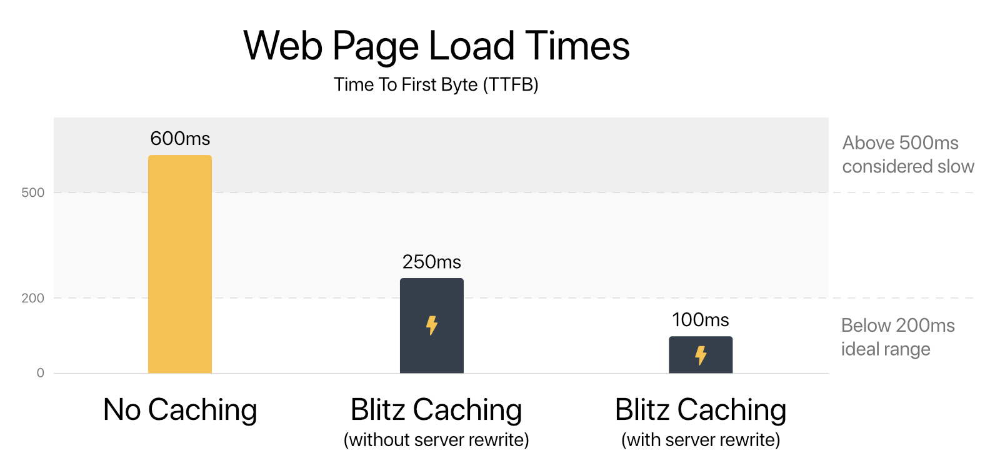
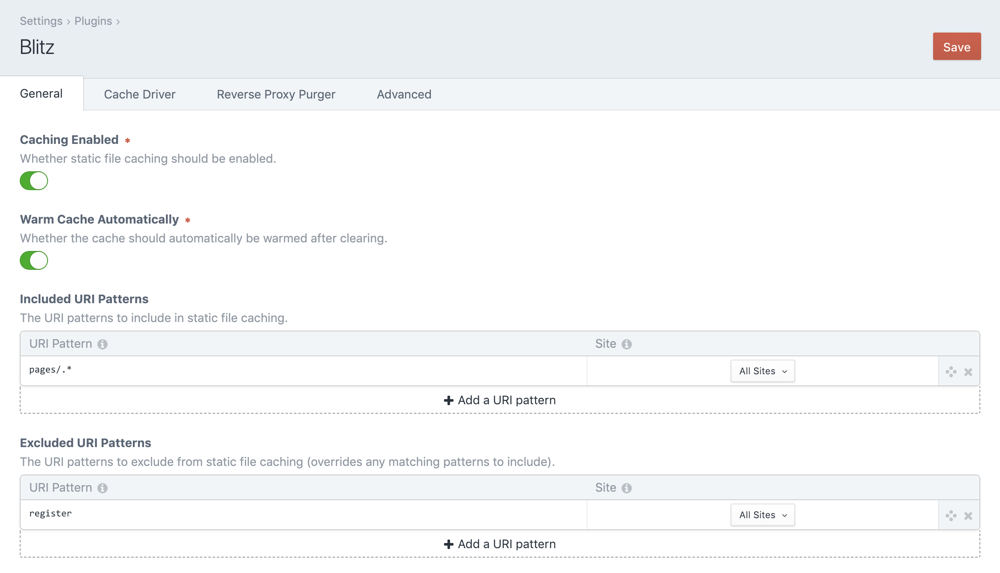
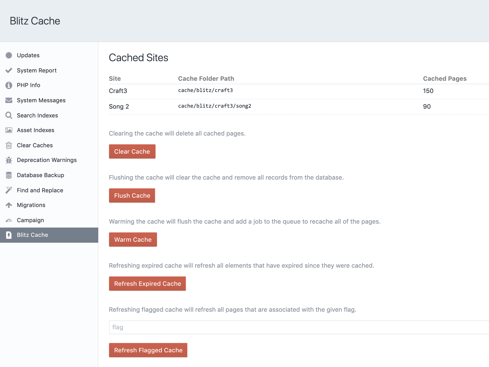
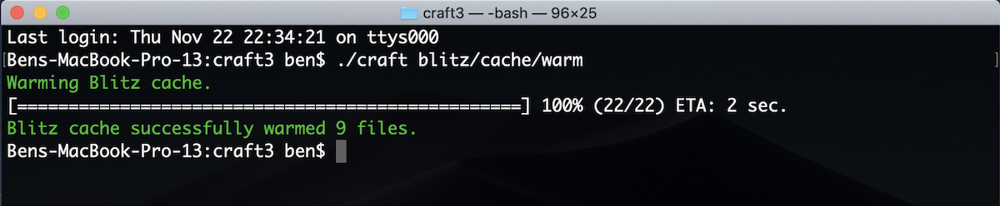

<p align="center"></p>

# Blitz Plugin for Craft CMS 3

> The Blitz v2 branch is currently in public beta and is not recommended for use in production environments. For the stable version, please visit the [v1 branch](https://github.com/putyourlightson/craft-blitz/tree/v1). The beta version can be installed using composer as follows.

```
composer require putyourlightson/craft-blitz:2.0.0-beta.7
```

The Blitz plugin provides intelligent full page caching (static file or in-memory) for creating lightning-fast sites with [Craft CMS](https://craftcms.com/).

- Reduces page load times (TTFB) and load on the server significantly. 
- Makes your site available even when performing updates and maintenance.
- Makes it possible to have your site served by a content delivery network (CDN).

Although the performance gains depend on the individual site and server setup, the following results are not uncommon (on a 5 Mbps cable connection with 28ms of latency). Google recommends a server response time of [200ms or less](https://developers.google.com/speed/docs/insights/Server). 

  

## Contents

- [License](#license)
- [Requirements](#installation)
- [Usage](#usage)
- [Settings](#settings)
- [How It Works](#how-it-works)
- [Credits](#credits)

## License

This plugin requires a commercial license which can be purchased through the Craft Plugin Store.  
The license fee is $59 plus $29 per subsequent year for updates (optional).

## Requirements

This plugin requires Craft CMS 3.1.0 or later.

## Usage

Install the plugin from the Craft Plugin Store in your site’s control panel or manually using composer.

```
composer require putyourlightson/craft-blitz
```

After installing the plugin, get set up using the following steps.

1. Turn “Enable Caching” on.
2. Add at least one row to “Included URI Patterns” such as `.*` to cache the entire site.
3. Save the settings and visit the site or warm the cache in the [Blitz Utility](#cache-invalidation).

Using a [server rewrite](#server-rewrite) will avoid unnecessary PHP processing and will increase performance even further.

Creating a cron job to [refresh expired cache](#refresh-expired-blitz-cache) (see below) will ensure that URIs that contain elements that have expired since they were cached are automatically refreshed when necessary.

Craft’s template caching `` tag doesn’t play well with the cache invalidation feature in Blitz. Template caching also becomes redundant with pull page caching, so it is best to either remove all template caching from URLs that Blitz will cache or to simply disable template caching completely in the `config/general.php` file:

```
'enableTemplateCaching' => false,
```

## Settings

### Caching Enabled

With this setting enabled, Blitz will begin caching pages according to your include/exclude URI patterns. Disable this setting to prevent Blitz from caching any new pages.

### Warm Cache Automatically

Whether the cache should automatically be warmed after clearing. With this setting enabled, Blitz will create a queue job to automatically visit pages whose cache has been cleared in the background. Disabling this setting may make sense if your site is very large and has many related elements.

### Included/Excluded URI Patterns

The URI patterns to include or exclude when caching. Blitz will only cache pages whose URI matches the UIR patterns, giving you fine-grain control over what is cached.

URI patterns use PCRE regular expressions. Below are some common use cases. You can reference the full syntax [here](http://php.net/manual/en/reference.pcre.pattern.syntax.php).

- A blank field matches the homepage.
- `.*` matches any character 0 or more times (use this to include everything).
- `.+` matches any character 1 or more times.
- `.` matches any character.
- `\d` matches any digit.
- `\d{4}` matches any four digits.
- `\w` matches any word character.
- `\w+` matches any word character 1 or more times.
- `entries` matches anything containing “entries”.
- `^entries` matches anything beginning with “entries”.
- `^entries/entry$` matches an exact URI.
- `^entries/\w+$` matches anything beginning with “entries/” followed by at least 1 word character.

### Cache Storage

The storage type to use for storing cached pages. The default and recommended storage type is “Blitz File Storage”. This stores cached pages as static HTML files in the specified “Folder Path”.

A “Yii Cache Storage” type is also available and will use whatever cache component Craft is set up to use. You can configure Craft to use alternative cache storage (MemCache, Redis, etc.) by overriding the cache application component from `config/app.php` as [explained in the docs](https://docs.craftcms.com/v3/config/app.html#cache-component).

### Reverse Proxy Purger

A purger to use for clearing cache in a reverse proxy. This allows you to use a reverse proxy cache service and CDN such as Cloudflare to deliver cached pages. Selecting a purger will tell Blitz to automatically purge (clear) the appropriate pages whenever they are updated.

### Query String Caching

URLs with query strings will be cached according to the selected option in the “Query String Caching” setting  as follows:

#### Do not cache URLs with query strings

URLs with query strings (anything following a `?` in a URL) will not be cached. Use this if query parameters dynamically affect a page’s output and should therefore never be cached.

#### Cache URLs with query strings as unique pages

URLs with query strings will be cached as unique pages, so `domain.com/about`, `domain.com/about?utm_source=twitter` and `domain.com/about?utm_source=facebook` will be cached separately. Use when query parameters affect a page’s output in a deterministic way and can therefore be cached as unique pages.

#### Cache URLs with query strings as the same page

URLs with query strings will be cached as the same page, so `domain.com/about`, `domain.com/about?utm_source=twitter` and `domain.com/about?utm_source=facebook` will all be cached with the same output. Use when query parameters do not affect a page’s output and can therefore be cached as the same page.

#### Concurrency

The max number of multiple concurrent requests to use when warming the cache. The higher the number, the faster the cache will be warmed and the more server processing will be required. A number between 5 and 20 is recommended.

#### API Key

An API key that can be used to clear, flush, warm, or refresh expired cache through a URL (min. 16 characters). The individual URLs are displayed below the field after a value has been saved.

### Config Settings

Blitz comes with a config file for a multi-environment way to set the plugin settings, as well as more advanced plugin configuration settings. To use it, copy the `config.php` to your project’s main `config` directory as `blitz.php` and uncomment any settings you wish to change.



## How It Works

When a URL on the site is visited that matches an included URI pattern, Blitz will serve a cached version of the page if it exists, otherwise it will display and cache the template output. Excluded URI patterns will override any matching included URI patterns. 

When an element is created, updated or deleted, any cached URLs that used that element are deleted. If the “Warm Cache Automatically” setting is enabled the a job is queued to warm the cleared cache.

Blitz is compatible with live preview. It will detect when it is being used and will not cache its output or display cached content (provided the server rewrite, if used, checks for GET requests only).

If a global is saved then Blitz will clear and warm the entire cache if the “Warm Cache Automatically” setting is enabled (and the `warmCacheAutomaticallyForGlobals` config setting has not been set to `false`). This is because globals are available on every page of every site and therefore can potentially affect every cached page. Globals should therefore be used sparingly, only in situations where the global value needs to be accessible from multiple pages. For anything else, consider using entries or categories over globals.

### Template Specific Options

It is possible to set template specific caching options by passing an object into the `options` function. All parameters are optional.

```
{% do craft.blitz.options({
    cachingEnabled: true,
    cacheElements: true,
    cacheElementQueries: true,
    cacheDuration: 'P1D',
    flag: 'listing',
    expiryDate: entry.eventDate
})
```

An alternative notation is to use method chaining on the model that the `options` function returns.
 
```
{% do craft.blitz.options.cacheDuration(P1D).flag('listing')
})
```

#### Caching Enabled

Setting this option to false will disable caching of this page.

#### Cache Elements

Setting this option to false will disable caching the elements used on this page in the database (used for cache invalidation).

#### Cache Element Queries

Setting this option to false will disable caching the element queries used on this page in the database (used for cache invalidation).

#### Cache Duration

The amount of time after which the cache should expire. If set to 0 then the cache will not get an expiry date. See [ConfigHelper::durationInSeconds()](https://docs.craftcms.com/api/v3/craft-helpers-conf) for a list of supported value types. 

[Duration intervals](https://en.wikipedia.org/wiki/ISO_8601#Durations) are a convenient way to set durations. Some common examples:
- PT1H (1 hour)
- P1D (1 day)
- P1W (1 week)
- P1M (1 month)

#### Flag

A flag (string) that will be associated with this page and that can can later be used to refresh flagged cache.

#### Expiry Date

A [DateTime](http://php.net/manual/en/class.datetime.php) object that will define when the cache should expire. The “Refresh Expired Cache” utility or controller action must be triggered to invalidate expired cache. 

### Dynamic Content

When a URL is cached, a cached version of the page will be served up on all subsequent requests. Therefore you should ensure that only pages that do not contain any content that needs to dynamically changed per individual request are cached. The easiest way to do this is to add excluded URI patterns for such pages. 

Blitz offers a workaround for injecting dynamic content into a cached page using a Javascript XHR (AJAX) request. The following template tags are available for doing so.

#### `{{ craft.blitz.getUri('/template/name') }}`

Returns a script that injects the contents of the URI provided in place of the twig tag. 

#### `{{ craft.blitz.csrfInput() }}`

Returns a script that injects a CSRF input field in place of the twig tag.

Below is an example of how you might use the tags to create a page containing dynamic content and a form that can be cached by Blitz.

```
Your cart: {{ craft.blitz.getUri('/ajax/cart-items') }}

<form method="post">
   {{ craft.blitz.csrfInput() }}
   ...
 
 </form>
```

In the case above it would make sense to add `ajax/.*` as an excluded URI pattern in the plugin settings.

### Cache Utility

The Blitz utility at “Utilities → Blitz Cache” displays the number of cached URIs for each site. It also provides the following functionality:

#### Clear Blitz Cache
Clearing the cache will delete all cached pages.

#### Flush Blitz Cache
Flushing the cache will clear the cache and remove all records from the database.

#### Warm Blitz Cache
Warming the cache will flush the cache and add a job to the queue to recache all of the pages.

#### Refresh Expired Blitz Cache
Refreshing expired cache will refresh all cached pages that have expired, or that contain elements that have expired (applies to elements with future post and expiry dates). Cache duration and expiry dates can be specified in the [config settings](config-settings) and the [template specific options](#template-specific-options).

#### Refresh Flagged Blitz Cache
Refreshing flagged cache will refresh all cached pages that were associated with the provided flag using the `flag` parameter in the [template specific options](#template-specific-options).

#### Cron Jobs
Create cron jobs using the following console commands to refresh expired or flagged cache on a scheduled basis. If entries are generally posted or expire on the hour then a good schedule might be every hour at 5 minutes past the hour. Change `/usr/bin/php` to the PHP path (if different).

```
// Refresh expired cache every hour at 5 minutes past the hour.
5 * * * * /usr/bin/php /path/to/craft blitz/cache/refresh-expired

// Refresh cache flagged with the flag “listing” every day at 6am.
0 6 * * * /usr/bin/php /path/to/craft blitz/cache/refresh-flagged listing
```



### Refreshing Cache with a URL

If an API key is set in “Settings → Advanced” then  it is possible to clear, flush, warm, refresh expired or refresh flagged cache through a URL. The available URLs are displayed under the API key field after the setting has been saved. 

### Console Commands

The following console commands with the functionality described above are also available.

    ./craft blitz/cache/clear
    
    ./craft blitz/cache/flush
    
    ./craft blitz/cache/warm
    
    ./craft blitz/cache/refresh-expired
    
    ./craft blitz/cache/refresh-flagged {flag}



### Server Rewrite

For improved performance, adding a server rewrite will avoid the request from ever being processed by Craft once it has been cached. 

#### Apache

In Apache this is achieved with `mod_rewrite` by adding a rewrite rule to the virtual host `.conf` file (this [article](https://nystudio107.com/blog/stop-using-htaccess-files-no-really) explains how), or the root `.htaccess` file if you must, just before the rewrites provided by Craft. Change `cache/blitz` to whatever the cache folder path is set to in the plugin settings.

If the “Query String Caching” setting is set to `Do not cache URLs with query strings` or `Cache URLs with query strings as unique pages` then use the following code.

```
# Blitz cache rewrite 
RewriteCond %{DOCUMENT_ROOT}/cache/blitz/%{HTTP_HOST}/%{REQUEST_URI}/%{QUERY_STRING}/index.html -s
RewriteCond %{REQUEST_METHOD} GET
RewriteRule .* /cache/blitz/%{HTTP_HOST}/%{REQUEST_URI}/%{QUERY_STRING}/index.html [L]

# Send would-be 404 requests to Craft
```

If the “Query String Caching” setting is set to `Cache URLs with query strings as the same page` then use the following code.

```
# Blitz cache rewrite 
RewriteCond %{DOCUMENT_ROOT}/cache/blitz/%{HTTP_HOST}/%{REQUEST_URI}/index.html -s
RewriteCond %{REQUEST_METHOD} GET
RewriteRule .* /cache/blitz/%{HTTP_HOST}/%{REQUEST_URI}/index.html [L]

# Send would-be 404 requests to Craft
```

#### Nginx

In Nginx this is achieved by adding a location handler to the configuration file. Change `cache/blitz` to whatever the cache folder path is set to in the plugin settings.

If the “Query String Caching” setting is set to `Do not cache URLs with query strings` or `Cache URLs with query strings as unique pages` then use the following code.

```
set $cache_path false;

if ($request_method = GET) {
    set $cache_path /cache/blitz/$host/$uri/$args/index.html;
}

location ~ ^(.*)$ {
    try_files $cache_path $uri $uri/ /index.php?p=$uri&$args;
}
```

If the “Query String Caching” setting is set to `Cache URLs with query strings as the same page` then use the following code.

```
set $cache_path false;

if ($request_method = GET) {
    set $cache_path /cache/blitz/$host/$uri/index.html;
}

location ~ ^(.*)$ {
    try_files $cache_path $uri $uri/ /index.php?p=$uri&$args;
}
```

### Debugging

Cached HTML pages are timestamped with a comment at the end of the page. 

```
<!-- Cached by Blitz on 2018-06-27T10:05:00+02:00 -->
```

If the HTML was served by the plugin rather than with a server rewrite then an additional comment is added.

```
<!-- Served by Blitz -->
```

Note that if your HTML is minified then all comments will be removed from the markup, including the comments above.

If the `sendPoweredByHeader` config setting is not set to `false` then an `X-Powered-By: Blitz` header will be sent.

## Credits

Blitz is actively developed and maintained by [PutYourLightsOn](https://putyourlightson.com/), yet it has had a tremendous amount of support from the Craft CMS community. 

A few people worth mentioning are: Oliver Stark; Andrew Welch; Ben Parizek.