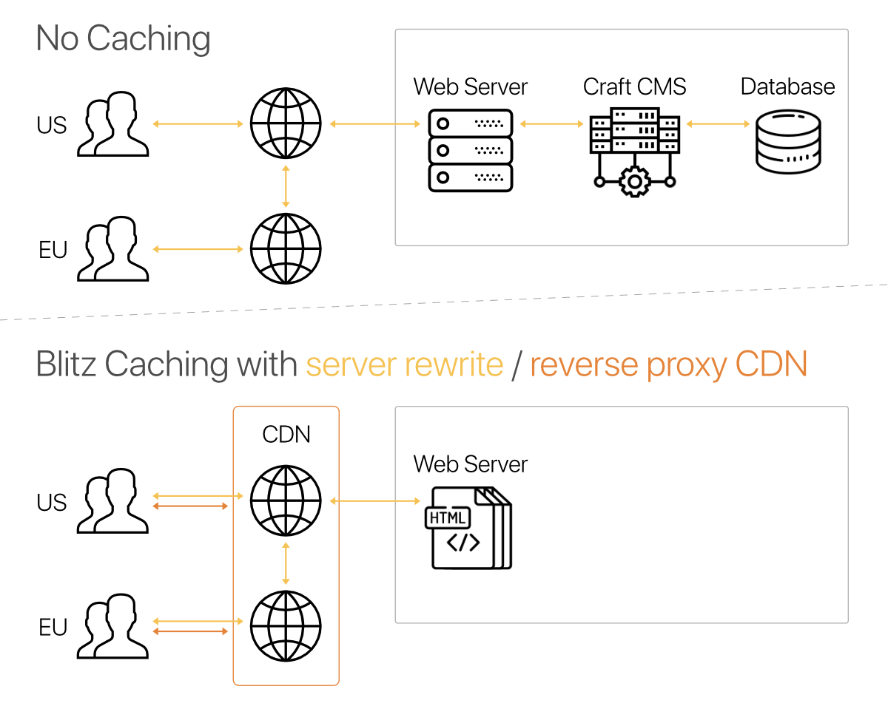

# Blitz Plugin for Craft CMS 3

The Blitz plugin provides intelligent full page caching for creating lightning-fast sites with [Craft CMS](https://craftcms.com/).

- Reduces server response time (TTFB) and load on the server significantly. 
- Makes your site available even when performing updates and maintenance.
- Makes it possible to have your site served by a reverse proxy CDN.

Although the performance gains depend on the individual site and server setup, the following results are not uncommon (on a 5 Mbps cable connection with 28ms of latency). Google recommends a server response time of [200ms or less](https://developers.google.com/speed/docs/insights/Server#recommendations). 

  

## Documentation

Read the documentation at [putyourlightson.com/craft-plugins/blitz/docs](https://putyourlightson.com/craft-plugins/blitz/docs).

## What’s New in Version 2

Blitz 2 is fast, easy to use and enhanced to be even more *scalable*, *extensible* and *predictable*.

**Scalable**  
Cache invalidation is faster and lighter with fewer database needs. Blitz 2 can also use Yii’s cache interface to tap into in-memory caches like [Memcache](https://memcached.org/) and [Redis](https://redis.io/). This makes Blitz a great fit for multi-node cloud platforms like [Docker](https://www.docker.com/), [Heroku](https://www.heroku.com/) and [fortrabbit](https://www.fortrabbit.com/).

**Extensible**  
Enjoy effortless full-page caching right at the edge with new reverse proxy purgers. Serve statically geneterate HTML pages from the [Cloudflare](https://www.cloudflare.com/) CDN and let Blitz take care of invalidation. You can add your own purgers for services like [Fastly](https://www.fastly.com/), [KeyCDN](https://www.keycdn.com/), and [Akamai](https://www.akamai.com).

**Predictable**  
Fine tune invalidation settings with expanded options for controlling when and how cached pages are handled. Set [page specific options](#page-specific-options) such as tags, cache durations and expiry dates. Use an API key and console commands to trigger actions on a schedule.

Visit and browse [craftcodingchallenge.com](https://craftcodingchallenge.com/) to see how fast a Blitz powered site really is.

## License

This plugin requires a commercial license which can be purchased through the [Craft Plugin Store](https://plugins.craftcms.com/blitz).  
The license fee is $59 plus $29 per subsequent year for updates (optional).

## Requirements

This plugin requires [Craft CMS](https://craftcms.com/) 3.1.0 or later.

Created by [PutYourLightsOn](https://putyourlightson.com/).