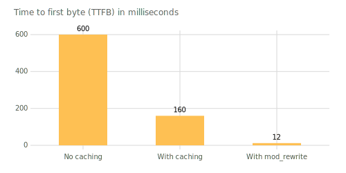
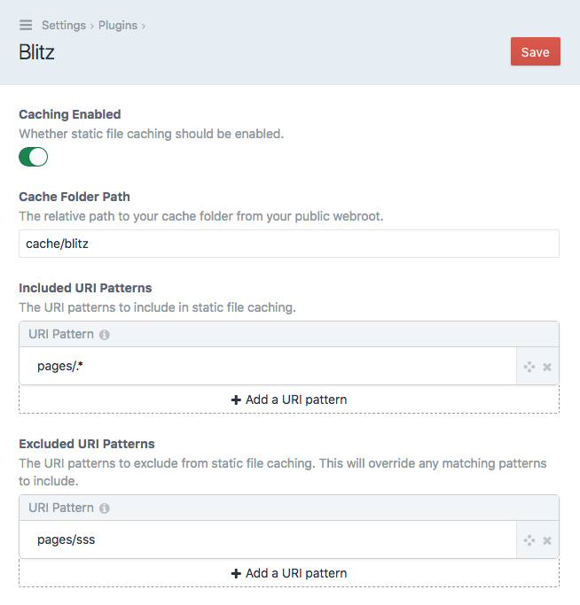
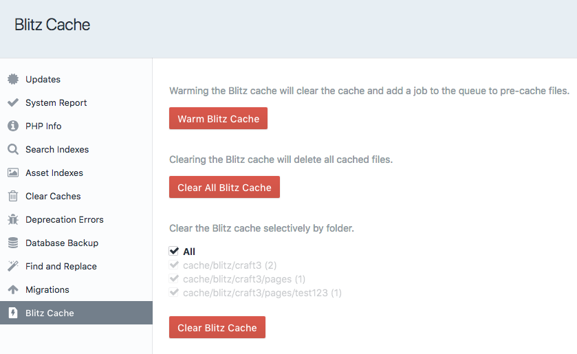

# Blitz Plugin for Craft CMS 3

The Blitz plugin provides intelligent static file caching for creating lightning-fast sites with  [Craft CMS](https://craftcms.com/).

It can highly improve a site's performance, reducing time to first byte (TTFB) dramatically. Although the performance gains depend on the individual site setup, the following results are not uncommon:

- 600ms (without caching enabled) 
- 160ms (with caching enabled, without server rewrite) 
- 12ms (with caching enabled and server rewrite)

This plugin is heavily inspired by the [Grav Static File Cache Plugin](https://github.com/fbrnc/grav-plugin-staticfilecache) by Fabrizio Branca.

## Requirements

Craft CMS 3.0.0 or later.

## Installation

To install the plugin, search for "Blitz" in the Craft Plugin Store, or install manually using composer.

    composer require putyourlightson/craft-blitz

## Usage

When caching is enabled and a URI on the site is visited that matches an included URI pattern, Blitz will serve a static cached HTML file if it exists, otherwise it will cache the template output to a HTML file. Excluded URI patterns will override any matching included URI patterns. Using a [server rewrite](#server-rewrite) (see below) will avoid unnecessary PHP processing and will increase performance even more.

## Precautions

When a URI is cached, the static cached file will be served up on all subsequent requests. Therefore you should ensure that only pages that do not contain any content that needs to dynamically changed based on the current visitor are cached. The easiest way to do this is to add excluded URI patterns for such dynamic pages.

## Cache Breaking

When an element is saved or deleted, any cached template files that used that element are deleted. A job is then automatically queued to refresh the cleared cache files. This applies to all element types, including global sets.

The "Blitz Cache" utility allows users to clear and warm the cache. Warming the cache will first clear the cache and then add a job to the queue to pre-cache files. Cached files and folders can be cleared manually using the  utility or by simply deleting them on the server.

The terminal can also be used to warm or clear all cache with the following console commands:

    ./craft blitz/cache/warm
    
    ./craft blitz/cache/clear

## Server Rewrite

For improved performance, adding a server rewrite will avoid the request from ever being processed by Craft once it has been cached. 

In Apache this is achieved with `mod_rewrite` by adding the following to the root .htaccess file. Change `cache/blitz` to whatever the cache folder path is set to in the plugin settings.

    # Blitz cache rewrite
    RewriteCond %{DOCUMENT_ROOT}/cache/blitz/%{HTTP_HOST}/%{REQUEST_URI}/index.html -f
    RewriteRule .* /cache/blitz/%{HTTP_HOST}/%{REQUEST_URI}/index.html [L]
    
    # Send would-be 404 requests to Craft

In Nginx this is achieved by adding a location handler to the configuration file. Change `cache/blitz` to whatever the cache folder path is set to in the plugin settings.

    # Blitz cache rewrite
    location / {
      try_files $uri /cache/blitz/$http_host/$uri/index.html $uri/ /index.php?$query_string;
    }

## URI Patterns

URI patterns use PCRE regular expressions. Below are some common use cases. You can reference the full syntax [here](http://php.net/manual/en/reference.pcre.pattern.syntax.php).

- `.` Matches any character
- `.*` Matches any character 0 or more times
- `.+` Matches any character 1 or more times
- `\d` Matches any digit
- `\d{4}` Matches any four digits
- `\w` Matches any word character
- `\w+` Matches any word character 1 or more times
- `entries/entry` Matches exact URI
- `entries/.*` Matches anything beginning with "entries/"
- `entries/.+` Matches anything beginning with "entries/" followed by at least 1 character

## Debugging

Cached HTML files are timestamped with a comment at the end of the file. 

    <!-- Generated by Blitz on 2018-06-27T10:05:00+02:00 -->

If the HTML file was served by the plugin rather than with a server rewrite then an additional comment is added.

    <!-- Served by Blitz -->
  
---

<small>Created by [PutYourLightsOn](https://www.putyourlightson.net/).</small>
