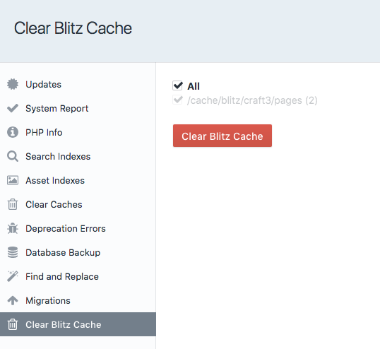

# Blitz Plugin for Craft CMS 3

The Blitz plugin provides intelligent static file caching for creating lightning-fast sites with  [Craft CMS](https://craftcms.com/).

This plugin is heavily inspired by the [Grav Static File Cache Plugin](https://github.com/fbrnc/grav-plugin-staticfilecache) by Fabrizio Branca.

## Requirements

Craft CMS 3.0.0 or later.

## Installation

To install the plugin, search for "Blitz" in the Craft Plugin Store, or install manually using composer.

    composer require putyourlightson/craft-blitz

## Usage

When caching is enabled and a URI on the site is visited that matches an included URI pattern, Blitz will serve a cached HTML file if it exists, otherwise it will cache the template output to a HTML file. Excluded URI patterns will override any matching included URI patterns.

## Clearing Cache

When an element is saved or deleted, any cached files for that element and its related elements will be cleared. A job is then automatically queued to refresh the cleared cache files.

Cached files can be cleared in batch using the "Clear Blitz Cache" utility.

## Server Rewrite

For improved performance, adding a server rewrite will avoid the request from ever being processed by Craft once it has been cached. 

With Apache this is achieved with `mod_rewrite` by adding the following to your .htaccess file. Change `cache/blitz` to whatever the cache folder path is set to in the plugin settings.

    # Blitz cache rewrite
    RewriteCond %{REQUEST_METHOD} GET
    RewriteCond %{HTTP:Pragma} !no-cache
    RewriteCond %{HTTP:Cache-Control} !no-cache
    RewriteCond %{DOCUMENT_ROOT}/cache/blitz/%{HTTP_HOST}/%{REQUEST_URI}.html -f
    RewriteRule .* /cache/blitz/%{HTTP_HOST}/%{REQUEST_URI}.html [L,E=nocache:1]
    
    # Send would-be 404 requests to Craft

## URI Patterns

URI patterns use PCRE regular expressions. Below are some common use cases. You can reference the full syntax [here](http://php.net/manual/en/reference.pcre.pattern.syntax.php).

- `.` Matches any character
- `.*` Matches any character 0 or more times
- `.+` Matches any character 1 or more times
- `\d` Matches any digit
- `\d{4}` Matches any four digits
- `\w` Matches any word character
- `\w+` Matches any word character 1 or more times
- `entries/entry` Matches exact URI
- `entries/.*` Matches anything beginning with "entries/"
- `entries/.+` Matches anything beginning with "entries/" followed by at least 1 character

## Debugging

Cached HTML files are timestamped with a comment at the end of the file. 

    <!-- Generated by Blitz on 2018-06-27T10:05:00+02:00 -->

If the HTML file was served by the plugin rather than with a server rewrite then an additional comment is added.

    <!-- Served by Blitz -->
  
---

<small>Created by [PutYourLightsOn](https://www.putyourlightson.net/).</small>
