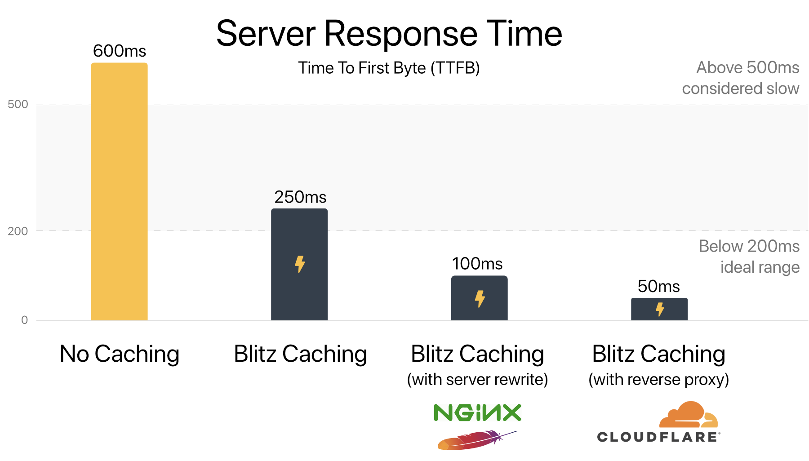
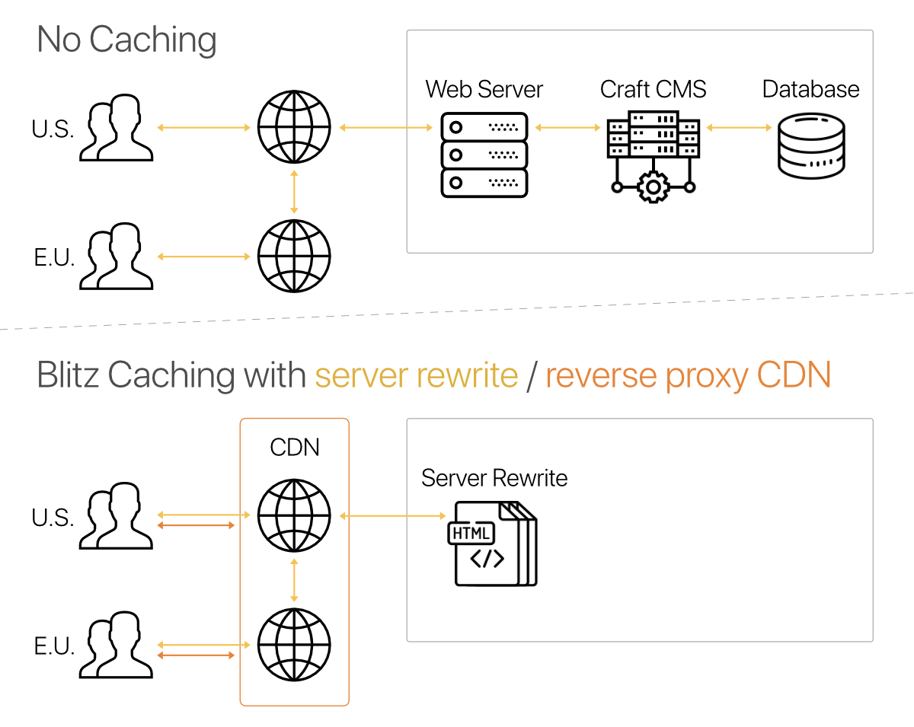
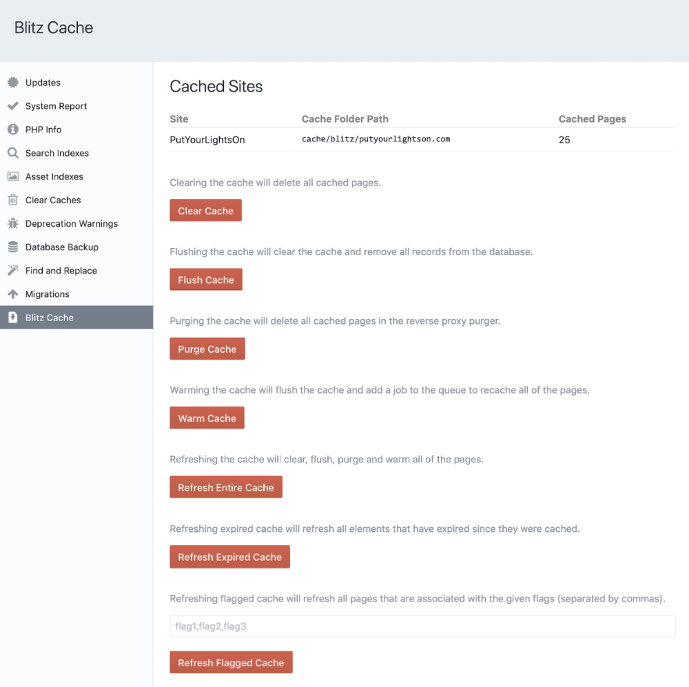
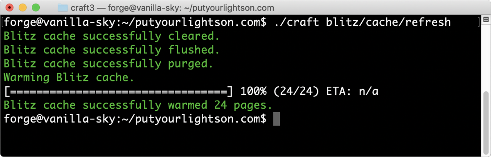
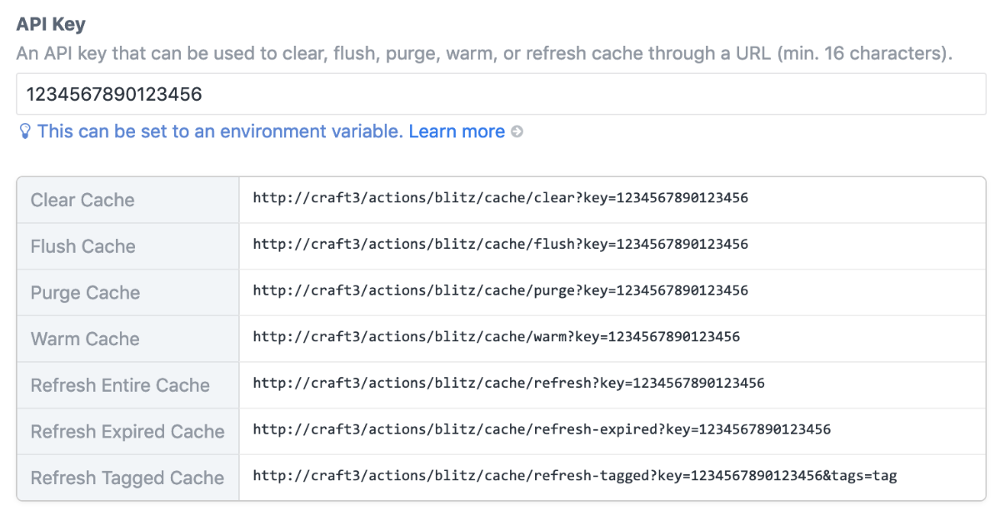
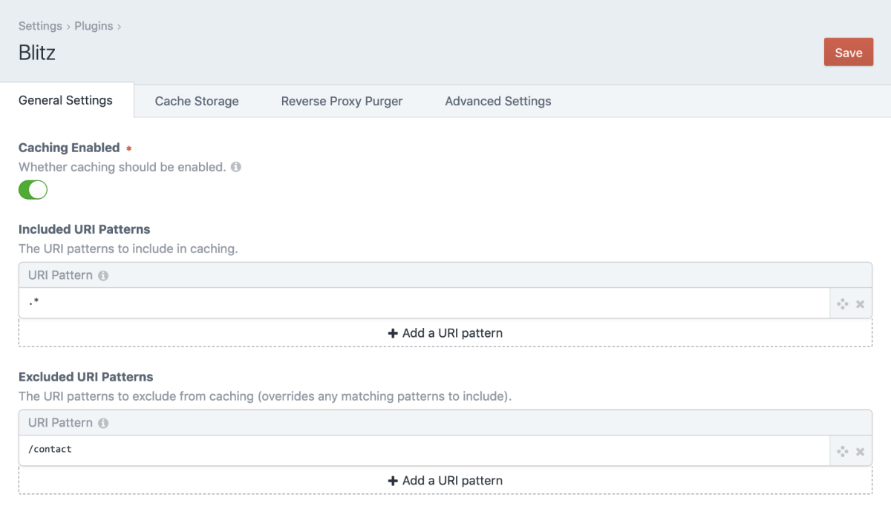
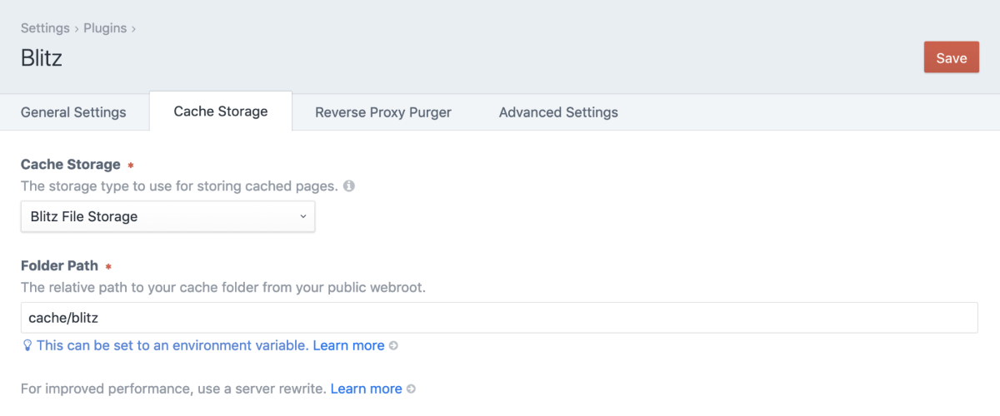
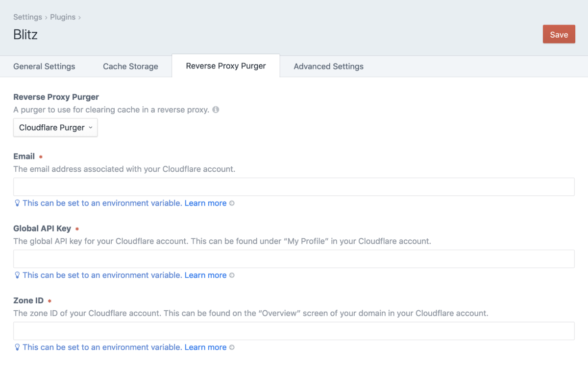
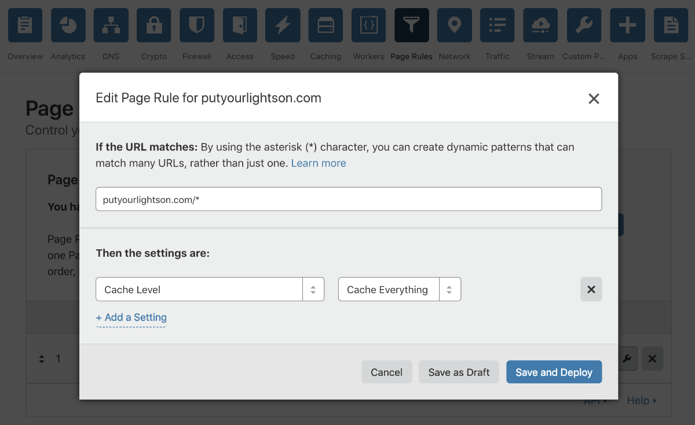
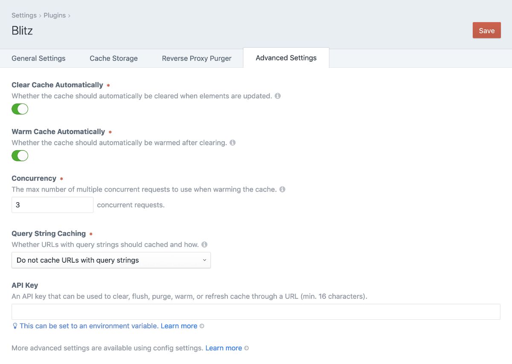

# Blitz Plugin Documentation

The Blitz plugin provides intelligent static page caching for creating lightning-fast sites with [Craft CMS](https://craftcms.com/).

- Reduces server response time (TTFB) and load on the server significantly. 
- Makes your site available even when performing updates and maintenance.
- Makes it possible to have your site served by a reverse proxy CDN.

Although the performance gains depend on the individual site and server setup, the following results are not uncommon (on a 5 Mbps cable connection with 28ms of latency). Google recommends a server response time of [200ms or less](https://developers.google.com/speed/docs/insights/Server#recommendations). 

  

## What’s New in Version 2

Blitz 2 is fast, easy to use and enhanced to be even more *scalable*, *extensible* and *predictable*.

**Scalable**  
Cache invalidation is faster and lighter with fewer database needs. Blitz 2 can also use Yii’s cache interface to tap into in-memory caches like [Memcache](https://memcached.org/) and [Redis](https://redis.io/). This makes Blitz a great fit for multi-node cloud platforms like [Docker](https://www.docker.com/), [Heroku](https://www.heroku.com/) and [fortrabbit](https://www.fortrabbit.com/).

**Extensible**  
Enjoy effortless full-page caching right at the edge with new reverse proxy purgers. Serve statically geneterate HTML pages from the [Cloudflare](https://www.cloudflare.com/) CDN and let Blitz take care of invalidation. You can add your own purgers for services like [Fastly](https://www.fastly.com/), [KeyCDN](https://www.keycdn.com/), and [Akamai](https://www.akamai.com).

**Predictable**  
Fine tune invalidation settings with expanded options for controlling when and how cached pages are handled. Set [page specific options](#page-specific-options) such as tags, cache durations and expiry dates. Use an API key and console commands to trigger actions on a schedule.

Visit and browse [craftcodingchallenge.com](https://craftcodingchallenge.com/) to see how fast a Blitz powered site really is.



## License

This plugin requires a commercial license which can be purchased through the [Craft Plugin Store](https://plugins.craftcms.com/blitz).  
The license fee is $59 plus $29 per subsequent year for updates (optional).

## Requirements

This plugin requires [Craft CMS](https://craftcms.com/) 3.1.0 or later.

# Basic Usage

## Getting Started

Install the plugin from the Craft Plugin Store in your site’s control panel or manually using composer.

```shell
composer require putyourlightson/craft-blitz
```

Blitz will not make any changes to your site when first installed. To start caching pages...

1. Turn “Enable Caching” on.
2. Add at least one row to “Included URI Patterns” such as `.*` to cache the entire site.
3. Save the settings and visit the site or warm the cache in the [Blitz cache utility](#cache-utility).

That's it! You should notice an immediate difference once Blitz is caching your pages. There are a few more optional steps you can take to cut even more time off that TTFB!

If you are using “Blitz File Storage” as the cache storage type, you can add Apache or Nginx [server rewrites](#server-rewrites) to avoid PHP processing for even better performance.

You can reduce the likelihood of visitors hitting un-cached pages by automatically keeping those caches warm. One way to do this is to create a cron job to [refresh expired cache](#refresh-expired-cache) regularly and automatically.

Craft’s `` tag doesn't always play well with Blitz cache invalidation. Since template caching becomes redundant with full page caching, it is best to remove  tags from templates Blitz caches, or simply disable template caching from `config/general.php`:

```php
'enableTemplateCaching' => false,
```

## How It Works

When a page is visited that matches an included URI pattern, Blitz will serve a cached version of the page if it has one. Otherwise, it will display and cache the template output. Excluded URI patterns will override any matching included URI patterns.

When an element is created, updated or deleted, any cached pages that used that element are deleted. If a reverse proxy purger such a Cloudflare is selected, the pages are purged. If the “Warm Cache Automatically” setting is enabled, a job is queued to warm the cleared cache.

Blitz is compatible with Craft’s Live Preview. It will detect when it is being used and not cache its output or display cached content.

If a Global is saved, Blitz will refresh the entire site cache if “Warm Cache Automatically” is enabled and the `warmCacheAutomaticallyForGlobals` config setting has not been set to `false`. This is because Globals are available on every page of every site and can potentially affect every single cached page. Globals should be used sparingly and only in situations where the global value needs to be accessible from multiple pages. For anything else, consider using Entries or Categories rather than Globals.

## Cache Utility

The Blitz cache utility at *Utilities → Blitz Cache* displays the number of cached URIs for each site (Blitz File Storage only). It also provides the following functionality.

### Clear Cache
Clearing the cache will delete all cached pages.

### Flush Cache
Flushing the cache will delete all records from the database.

> Flushing the cache does *not* clear the cache, as it did in Blitz 1.

### Warm Cache
Warming the cache will warm all of the pages by creating a queue job to visit each of them.

>  Warming the cache does *not* clear and flush the cache, as it did in Blitz 1.

### Refresh Entire Cache

Refreshing the cache will clear, flush, purge and warm all of the pages.

### Refresh Expired Cache
Refreshing expired cache will refresh all cached pages that have expired, or that contain Elements that have expired (applies to Elements with future post and expiry dates). Cache duration and expiry dates can be specified in the [config settings](#config-settings) and the [page specific options](#page-specific-options).

### Refresh Tagged Cache
Refreshing tagged cache will refresh all cached pages that were associated with the provided tags using the `tags` parameter in the [page specific options](#page-specific-options).



## Console Commands

Every cache utility function above is also available as a console command.

```shell
./craft blitz/cache/clear

./craft blitz/cache/flush

./craft blitz/cache/warm

./craft blitz/cache/refresh

./craft blitz/cache/refresh-expired

./craft blitz/cache/refresh-tagged tag1,tag2,tag3
```



## Refreshing Cache via URL

Once you have created an API key in *Settings → Advanced*, you can trigger each of the cache utilities through a URL. Those URLs are displayed under the API key field after the setting has been saved.



# Settings

## Control Panel Settings

### Caching Enabled

With this setting enabled, Blitz will begin caching pages according to the included/excluded URI patterns. Disable this setting to prevent Blitz from caching any new pages.

### Included/Excluded URI Patterns

The URI patterns to include or exclude when caching. Blitz will only cache pages whose URI matches the URI patterns, giving you fine-grain control over what is cached.

URI patterns use PCRE regular expressions ([cheat sheet](https://www.debuggex.com/cheatsheet/regex/pcre)). Below are some common use cases.

| Pattern           | Description                                 |
| ----------------- | ------------------------------------------- |
| `.`               | Matches any character.                      |
| `.*`              | Matches any character 0 or more times.      |
| `.+`              | Matches any character 1 or more times.      |
| `\d`              | Matches any digit.                          |
| `\d{4}`           | Matches any four digits.                    |
| `\w`              | Matches any word character.                 |
| `\w+`             | Matches any word character 1 or more times. |
| `entries`         | Matches anything containing `entries`.      |
| `^entries`        | Matches anything beginning with `entries`.  |
| `^entries/entry$` | Matches the exact URI `entries/entry`.      |



### Cache Storage

The storage type to use for storing cached pages. The default and recommended storage type for most sites is “Blitz File Storage”. This stores cached pages as static HTML files in the specified “Folder Path” and is extremely performant, especially when used with [server rewrites](#server-rewrites).

A “Yii Cache Storage” type is also available and will use whatever cache component Craft is set up to use. You can configure Craft to use alternative cache storage (Memcache, Redis, etc.) by overriding the cache application component from `config/app.php` as explained in the [Craft docs](https://docs.craftcms.com/v3/config/app.html#cache-component). This is the recommended storage type for multi-node cloud platforms like [Docker](https://www.docker.com/), [Heroku](https://www.heroku.com/) and [fortrabbit](https://www.fortrabbit.com/).

You can extend Blitz to add your own [custom cache storage types](#custom-cache-storage-types).



### Reverse Proxy Purger

A purger to use for clearing cache in a reverse proxy. This allows you to use a reverse proxy cache service and CDN such as Cloudflare to deliver cached pages. Selecting a purger will tell Blitz to automatically purge the appropriate pages whenever they are updated.

You can extend Blitz to add your own [custom reverse proxy purgers](#custom-reverse-proxy-purgers).



Cloudflare does not cache HTML by default. To enable static page caching, create a new page rule in the “Page Rules” page of the domain in your account (you get 3 page rules with a free plan). Enter a URL pattern such as `domain.com/*` and add a “Cache Level” setting with a value of “Cache Everything”. Click “Save and Deploy” and then visit your site. With dev tools open you should see a cache response (`HIT`, `MISS`, etc.) in the `CF-Cache-Status` header.



### Clear Cache Automatically

Whether the cache should automatically be cleared after elements are updated. With this setting disabled, Blitz will mark affected page caches as expired without actually delete them. In order to delete them, the “Refresh Expired Cache” [utility](#refresh-expired-cache) or [console command](#console-commands) should be used. Disabling this setting may make sense if your site gets heavy traffic and clearing cache should be limited to specific times or intervals.

### Warm Cache Automatically

Whether the cache should automatically be warmed after clearing. With this setting enabled, Blitz will create a queue job to automatically visit pages whose cache has been cleared in the background. Disabling this setting may make sense if your site is very large and has many related elements.

### Concurrency

The max number of concurrent requests to use when warming the cache. The higher the number, the faster the cache will be warmed but the more server processing will be required. A number between 1 and 5 is recommended.

### Query String Caching

URLs with query strings will be cached according to the selected option in the “Query String Caching” setting  as follows:

#### `Do not cache URLs with query strings`

URLs with query strings (anything following a `?` in a URL) will not be cached. Use this if query parameters dynamically affect a page’s output and should therefore never be cached.

#### `Cache URLs with query strings as unique pages`

URLs with query strings will be cached as unique pages, so `domain.com/about`, `domain.com/about?utm_source=twitter` and `domain.com/about?utm_source=facebook` will be cached separately. Use when query parameters affect a page’s output in a deterministic way and can therefore be cached as unique pages.

#### `Cache URLs with query strings as the same page`

URLs with query strings will be cached as the same page, so `domain.com/about`, `domain.com/about?utm_source=twitter` and `domain.com/about?utm_source=facebook` will all be cached with the same output. Use when query parameters do not affect a page’s output and can therefore be cached as the same page.

### API Key

An API key that can be used to clear, flush, warm, or refresh cache through a URL (min. 16 characters). The individual URLs are displayed below the field after a value has been saved.



## Config Settings

Blitz comes with a config file for a multi-environment way to set the plugin settings, as well as more advanced plugin configuration settings. To use it, copy the `config.php` to your project’s main `config` directory as `blitz.php` and uncomment any settings you wish to change. All of the available settings are listed and documented in the [config file](https://github.com/putyourlightson/craft-blitz/blob/v2/src/config.php).

# Advanced Usage

## Dynamic Content

When a page is cached, the cached version of that page will be served up on all subsequent requests. You should therefore avoid caching pages whose entire content changes per individual request. The easiest way to do this is to add excluded URI patterns for such pages. 

Blitz offers a workaround for injecting dynamic content into a cached page using a Javascript XHR (AJAX) request. The following template tags are available for doing so.

### `{{ craft.blitz.getUri('/template/name') }}`

Returns a script that injects the contents of the URI provided in place of the twig tag. 

### `{{ craft.blitz.csrfInput() }}`

Returns a script that injects a CSRF input field in place of the twig tag.

Below is an example of how you might use the tags to create a page containing dynamic content and a form page that can be cached by Blitz.

```twig
Your cart: {{ craft.blitz.getUri('/ajax/cart-items') }}

<form method="post">
   {{ craft.blitz.csrfInput() }}
   ...
 
 </form>
```

## Page Specific Options

It is possible to set page specific caching options in your twig templates by passing an object into the `craft.blitz.options()` function. All parameters are optional.

```twig

```

An alternative notation is to use method chaining on the model that the `craft.blitz.options()` function returns.

```twig

```

### `cachingEnabled`

Setting this option to `false` will disable caching of this page.

### `cacheElements`

Setting this option to `false` will disable caching the elements used on this page in the database (used for cache invalidation).

### `cacheElementQueries`

Setting this option to `false` will disable caching the element queries used on this page in the database (used for cache invalidation).

### `cacheDuration`

The amount of time after which the cache should expire. If set to 0 then the cache will not get an expiry date. See [ConfigHelper::durationInSeconds()](https://docs.craftcms.com/api/v3/craft-helpers-conf) for a list of supported value types. [Duration intervals](https://en.wikipedia.org/wiki/ISO_8601#Durations) are a convenient way to set durations. Common examples include:
- `PT1H` (1 hour)
- `P1D` (1 day)
- `P1W` (1 week)
- `P1M` (1 month)

### `expiryDate`

A [DateTime](http://php.net/manual/en/class.datetime.php) object that will define when the cache should expire. The “Refresh Expired Cache” [utility](#refresh-expired-cache) or [console command](#console-commands) must be used to invalidate expired cache. 

### `tags`

One or more tags (array or string separated by commas) that will be associated with this page. Tags should not contain spaces. The “Refresh Tagged Cache” [utility](#refresh-tagged-cache) or [console command](#console-commands) can be used to invalidate tagged cache.

## Cron Jobs
Create cron jobs using the following console commands to refresh expired or tagged cache on a scheduled basis. If entries are generally posted or expire on the hour then a good schedule might be every hour at 5 minutes past the hour. Change `/usr/bin/php` to the PHP path (if different).

> Entering `which php` in the console will give you the full path to PHP in most environments.

```shell
// Refresh expired cache every hour at 5 minutes past the hour.
5 * * * * /usr/bin/php /path/to/craft blitz/cache/refresh-expired

// Refresh cache tagged with the tags “home” and “listing” every day at 6am.
0 6 * * * /usr/bin/php /path/to/craft blitz/cache/refresh-tagged home,listing
```

## Server Rewrites

For improved performance when using the “Blitz File Storage” type, adding a server rewrite will avoid the request from ever being processed by Craft once it has been cached. This leads to extremely performant loading of cached pages.

### Apache

In Apache this is achieved with `mod_rewrite` by adding a rewrite rule to the virtual host `.conf` file ([this article](https://nystudio107.com/blog/stop-using-htaccess-files-no-really) explains how), or the root `.htaccess` file if you must, just before the rewrites provided by Craft. 

> Change `cache/blitz` to the cache folder path designated in the plugin settings.

If the “Query String Caching” setting is set to `Do not cache URLs with query strings` or `Cache URLs with query strings as unique pages` then use the following code.

```apacheconf
# Blitz cache rewrite
RewriteCond %{DOCUMENT_ROOT}/cache/blitz/%{HTTP_HOST}/%{REQUEST_URI}/%{QUERY_STRING}/index.html -s
RewriteCond %{REQUEST_METHOD} GET
RewriteRule .* /cache/blitz/%{HTTP_HOST}/%{REQUEST_URI}/%{QUERY_STRING}/index.html [L]

# Send would-be 404 requests to Craft
```

If the “Query String Caching” setting is set to `Cache URLs with query strings as the same page` then the `/%{QUERY_STRING}` segment should be removed.

```apacheconf
# Blitz cache rewrite
RewriteCond %{DOCUMENT_ROOT}/cache/blitz/%{HTTP_HOST}/%{REQUEST_URI}/index.html -s
RewriteCond %{REQUEST_METHOD} GET
RewriteRule .* /cache/blitz/%{HTTP_HOST}/%{REQUEST_URI}/index.html [L]

# Send would-be 404 requests to Craft
```

### Nginx

In Nginx this is achieved by adding a location handler to the configuration file. 

> Change `cache/blitz` to the cache folder path designated in the plugin settings.

If the “Query String Caching” setting is set to `Do not cache URLs with query strings` or `Cache URLs with query strings as unique pages` then use the following code.

```nginx
# Blitz cache rewrite
set $cache_path false;
if ($request_method = GET) {
    set $cache_path /cache/blitz/$host/$uri/$args/index.html;
}
location / {
    try_files $cache_path;
}

# Send would-be 404 requests to Craft
location / {
    try_files $uri $uri/ /index.php?$query_string;
}

```

If the “Query String Caching” setting is set to `Cache URLs with query strings as the same page` then the `/$args` segment should be removed.

```nginx
# Blitz cache rewrite
set $cache_path false;
if ($request_method = GET) {
    set $cache_path /cache/blitz/$host/$uri/index.html;
}
location / {
    try_files $cache_path;
}

# Send would-be 404 requests to Craft
location / {
    try_files $uri $uri/ /index.php?$query_string;
}
```

## Debugging

Cached HTML pages are timestamped with a comment at the end of the page. 

```html
<!-- Cached by Blitz on 2018-06-27T10:05:00+02:00 -->
```

If the HTML was served by the plugin rather than with a server rewrite then an additional comment is added.

```html
<!-- Served by Blitz -->
```

Note that if your HTML is minified then all comments will be removed from the markup, including the comments above.

If the `sendPoweredByHeader` config setting is not set to `false` then an `X-Powered-By: Blitz` header will be sent.

# Extending Blitz

## Custom Cache Storage Types

In addition to the provided cache storage types, you can write your own by extending the `BaseCacheStorage` abstract class. See the implementation of the `putyourlightson\blitz\drivers\storage\FileStorage` class.

```php
<?php
namespace vendor\package;

use putyourlightson\blitz\drivers\storage\BaseCacheStorage;

class MyCacheStorage extends BaseCacheStorage
{
    // Override base methods
}
```

To add your cache storage type to Blitz, you can create a stand-alone composer package for it. Install the package with `composer require` and then add the class to the `cacheStorageTypes` [config setting](#config-settings) in `config/blitz.php`.

```php
// The storage type classes to add to the plugin’s default storage types.
'cacheStorageTypes' => [
    'vendor\package\MyCacheStorage'
],
```

If you prefer to write your cache storage type as a module or plugin, then register it by listening for the `EVENT_REGISTER_STORAGE_TYPES` event and adding the class to the `$event->types` array.

```php
use craft\events\RegisterComponentTypesEvent;
use putyourlightson\blitz\helpers\CacheStorageHelper;
use vendor\package\drivers\storage\MyCacheStorage;
use yii\base\Event;

Event::on(CacheStorageHelper::class, 
     CacheStorageHelper::EVENT_REGISTER_STORAGE_TYPES,
     function(RegisterComponentTypesEvent $event) {
         $event->types[] = MyCacheStorage::class;
     }
);
```

## Custom Reverse Proxy Purgers

In addition to the provided reverse proxy purgers, you can write your own by extending the `BaseCachePurger` abstract class. See the implementation of the `putyourlightson\blitz\drivers\purgers\CloudflarePurger` class.

```php
<?php
namespace vendor\package;

use putyourlightson\blitz\drivers\storage\BaseCachePurger;

class MyCachePurger extends BaseCachePurger
{
    // Override base methods
}
```

To add your cache purger to Blitz, you can create a stand-alone composer package for it. Install the package with `composer require` and then add the class to the `cachePurgerTypes` [config setting](#config-settings) in `config/blitz.php`.

```php
// The purger type classes to add to the plugin’s default purger types.
'cachePurgerTypes' => [
    'putyourlightson\blitz\drivers\purgers\CloudflarePurger',
    'vendor\package\MyCachePurger',
],
```

Cache purger packages:

- [KeyCDN](https://github.com/putyourlightson/craft-blitz-keycdn) (PutYourLightsOn)

If you prefer to write your cache purger as a module or plugin, then register it by listening for the `EVENT_REGISTER_PURGER_TYPES` event and adding the class to the `$event->types` array.

```php
use craft\events\RegisterComponentTypesEvent;
use putyourlightson\blitz\helpers\CachePurgerHelper;
use vendor\package\drivers\purgers\MyCachePurger;
use yii\base\Event;

Event::on(CachePurgerHelper::class, 
     CachePurgerHelper::EVENT_REGISTER_PURGER_TYPES,
     function(RegisterComponentTypesEvent $event) {
         $event->types[] = MyCachePurger::class;
     }
);
```

# More

## Common Issues

> “The site is not being cached when I visit it.”

Ensure that the *Caching Enabled* setting is switched on and that the page you are visiting matches an *Included URI Pattern* (and not an *Excluded URI Pattern*). Blitz will not cache pages that display the debug toolbar so check that you are *not* logged in as an admin with the debug toolbar enabled on the front-end.

> “The refresh cache queue job is stalling.”

This is likely due to PHP timing out or running out of memory and is a [common issue](https://craftcms.com/guides/resolving-stalled-background-tasks) in Craft. For large sites  we recommend increasing `max_execution_time` to `300` and `memory_limit` to at least `1024M`.  The [Async Queue](https://plugins.craftcms.com/async-queue) plugin can help prevent timeouts and memory issues by running jobs as background tasks and the [Queue Manager](https://plugins.craftcms.com/queue-manager) plugin allows you to see what jobs are in the queue and manipulate them.

## Support

Support is provided through GitHub [issues](https://github.com/putyourlightson/craft-blitz/issues) and by email at info@putyourlightson.net.

## Credits

Blitz is actively developed and maintained by [PutYourLightsOn](https://putyourlightson.com/), yet it has had a tremendous amount of support from the Craft CMS community. 

A few people worth mentioning for their valuable input are: Oliver Stark; Andrew Welch; Ben Parizek.